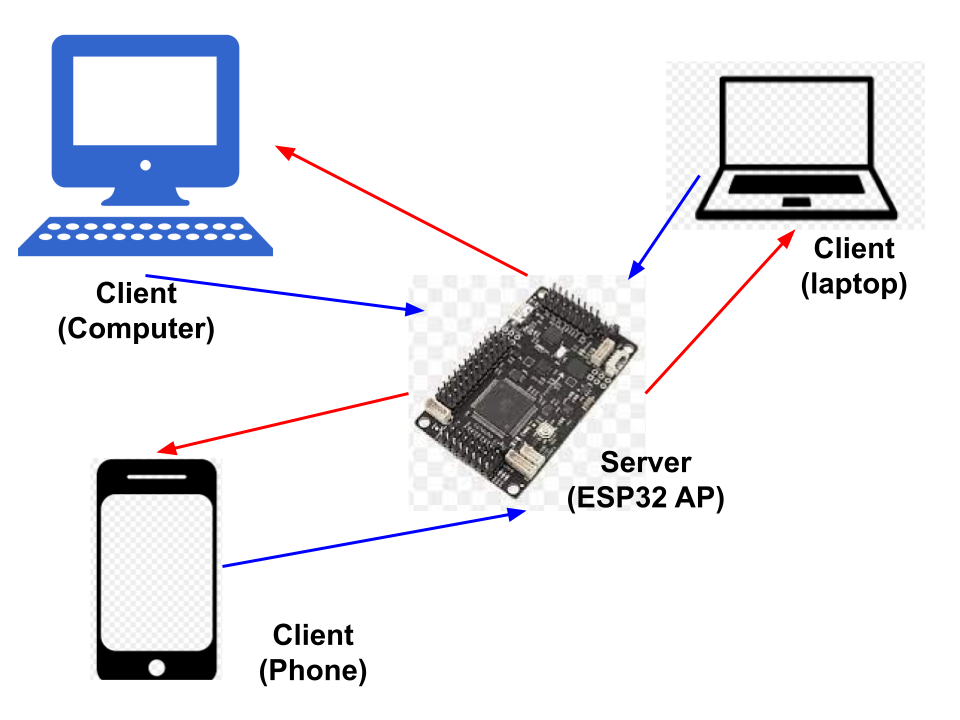
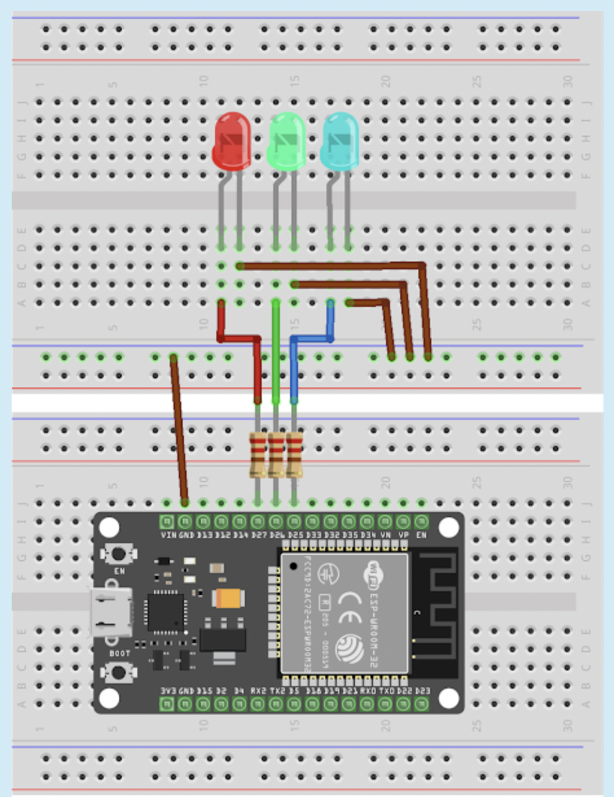

# enmeraz-Wifi_Lamp

# Introduction
## Description of Project: 
For my final project I wanted to create a LED lamp that creates a Wifi network. I will attempt to use a ESP32 to create a wifi network for a web server using Access Points (AP). The following network can be shown below.

     

Once everything is set up, the user must log into the wifi network that the code has created. Next the user can go into their favorite web browser and enter 192.168.4.1 (or whatever the device gives out as a IP address) in the web address to begin.  

# Setting up your ESP32 or ESP8266 on Arduino IDE
First we have to add our board entries:
1. Open the Arduino IDE. Make sure that you are at version 1.8 or higher, if not then update your IDE with the latest version.
2. Click on the File menu on the top menu bar.
3. Click on the Preferences menu item. This will open a Preferences dialog box.
4. You should be on the Settings tab in the Preferences dialog box by default.
5. Look for the textbox labeled “Additional Boards Manager URLs”.
6. If there is already text in this box add a coma at the end of it, then follow the next step.
7. Paste the following link into the text box – https://raw.githubusercontent.com/espressif/arduino-esp32/gh-pages/package_esp32_index.json
8. Click the OK button to save the setting.

For ESP32:
1. In your arduino IDE you need to click on the Tools menu on the top menu bar
2. Scroll down to the Board: entry (i.e. Board: Arduino/Genuino Uno).
3. A submenu will open when you highlight the Board: entry.
4. At the top of the submenu is Boards Manager. Click on it to open the Boards Manager dialog box.
5. In the search box in the Boards Manager enter “esp32”.
6. You should see an entry for “esp32 by Espressif Systems”. Highlight this entry and click on the Install button.
7. This will install the ESP32 boards into your Arduino IDE

For ESP8266:
1. In your arduino IDE you need tto click on the Tools menu on the top menu bar
2. Scroll down to the Board: entry (i.e. Board: Arduino/Genuino Uno).
3. A submenu will open when you highlight the Board: entry.
4. At the top of the submenu is Boards Manager. Click on it to open the Boards Manager dialog box.
5. In the search box in the Boards Manager enter “ESP8266”.
6. You should see an entry for “ESP8266 by ESP8266 Community”. Highlight this entry and click on the Install button.
7. This will install the ESP8266 boards into your Arduino IDE

# Setting up the BreadBoard

     

- Resistors is 215 ohmns (220 ohms with 1%)

# File locations

## Wifi Network Locations
### Description: 
This code will program the ESP32 to scan for WiFi networks (will call to wifi).
### Location: https://github.com/enmeraz/enmeraz-Wifi_Lamp/tree/main/test_%26setup/WiFi_connect

## Light-Up Each LED Seprate

### Version: webAp
### Description: 
This code will program the microcontroller to create a wifi network to host a web server. In this webserver we will be able to press three buttons. Each button will turn on a different color LED.
### Location: https://github.com/enmeraz/enmeraz-Wifi_Lamp/tree/main/wifiLamp_FINAL/webAp

### Version: webAp1.02
### Description: 
For version 1.02 and 1.03 we tried to change the status of each button. For example, in the first version we were checking if the HTTP request of the connected client is using the HTTP GET function, to then turn the LED on/off according to the HTTP request. However, we created a new function to help maintain the different stages of each the LED light. The reason why was to help determine which ones should stay on when clicking one of the buttons. 
### Location: https://github.com/enmeraz/enmeraz-Wifi_Lamp/tree/main/wifiLamp_FINAL/webAp1.02

### Version: webAp1.03
### Description: 
As we continue to build based on version two and fix current bugs. Currents bugs we are facing is the HTTP request was not going through our updateLED function. 
### Location: https://github.com/enmeraz/enmeraz-Wifi_Lamp/tree/main/wifiLamp_FINAL/webAp1.03

### Version: webAp1.04
### Description: 
For the final version, we were successful on changing the states of each button and then we reprogrammed it so now when you click on one of the buttons, you will get a certain sequence (special pattern) for the LEDs. In addition, if one sequence is on and you turn on another sequence then it will automaticlly turn off. 
### Location: https://github.com/enmeraz/enmeraz-Wifi_Lamp/tree/main/wifiLamp_FINAL/webAp1.04